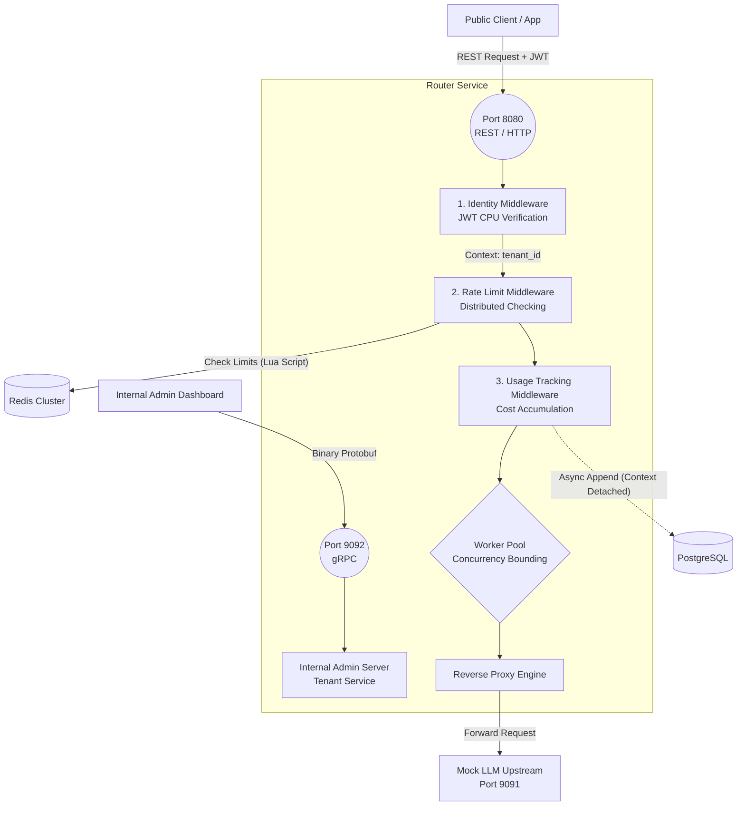

# Day 14 — Two Weeks In (System Design & Reflection)

**Concept Mastered:** High-level system architecture, Mermaid diagrams, and identifying bottlenecks (Load Testing).
**Built:** The `cmd/loadtester` utility to hammer our API Gateway and prove our Redis Rate Limiter actually works in a high-concurrency scenario.

---

## 1. The 2-Week Architecture Diagram
Over the last two weeks, we've built a robust, production-grade AI Proxy Gateway. Here is the complete System Architecture of everything we've built so far:

## 2. Honest Reflection: "What was harder than expected?"
Two weeks in, the most surprisingly difficult part of building an infrastructure tool like this wasn't the API design, it was **Context Lifecycle Management**.

When building the Usage-Tracking Middleware (Day 11), we realized that if the client disconnects, Go automatically cancels the `http.Request` context. If we used that context to save the billing record to PostgreSQL, the database call would instantly abort, and the user would get a free LLM query. We had to build a custom `contextWithoutCancel` trick to safely detach the background database write from the HTTP request lifecycle. 

In microservices, the hardest part isn't writing the code—it's handling what happens when things suddenly disconnect or fail concurrently.

## 3. The Day 14 System Design Exercise (Load Testing)
To truly review our system, we built `cmd/loadtester` today. 
It spins up dozens of concurrent Go routines that aggressively hammer our API on Port 8080 with a valid JWT.

**Why?**
Because next week (Week 3) is all about **Reliability**. By hammering the system today, we force our Redis Rate Limiter to kick in and reject requests. In the real world, when requests are rejected, clients need to know how to retry intelligently without bringing the server down (The Thundering Herd problem). Our load tester proves the limit works, setting the stage for Day 15's lesson on Exponential Backoff.

## 4. What to say out loud in 60 seconds

*"It’s been two weeks of building the AI Proxy Gateway, and today was a deep-dive reflection on the architecture. I mapped out the entire system flow from the public REST port and the internal gRPC port down to the Redis rate-limiting and Postgres billing layers. The hardest challenge so far has been managing request contexts—specifically ensuring background billing writes succeed even if the client suddenly drops the connection. To wrap up the week, I built a custom Go load-tester to aggressively hammer the proxy, intentionally triggering rate-limit rejections to set the stage for Week 3’s focus on Reliability and Exponential Backoff."*
