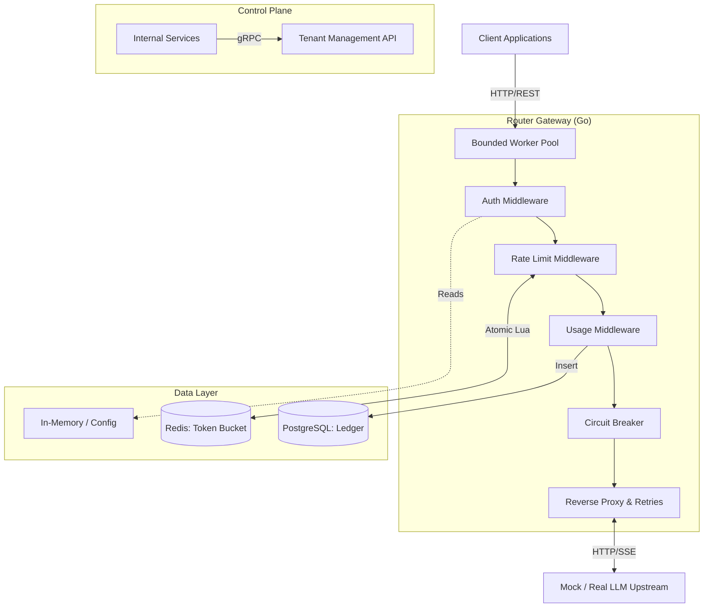

# Router: AI Inference Gateway — Architectural Analysis (Day 1 - Day 16)

This document provides an expert-level technical breakdown of the Router system architecture as implemented up to Day 16 of the 60-Day Roadmap. It analyzes the systemic design decisions, distributed systems concepts, and explicit engineering tradeoffs made to achieve a production-grade inference gateway.

## 1. High-Level System Architecture

The Router operates as a high-performance, fault-tolerant middleware layer between client applications and external LLM providers (e.g., OpenAI, Anthropic). 

## 2. Component Design & Tradeoffs

### 2.1. Concurrency Model: Bounded Worker Pool
* **Implementation:** `internal/workerpool`
* **Mechanism:** A fixed-size channel acting as a semaphore limits concurrent `ServeHTTP` executions, coupled with a bounded queue for requests waiting for an available worker.
* **Tradeoff Analysis:**
    * **Unbounded (`go func()`)** scales effortlessly under normal load but leads to catastrophic failure (OOM, file descriptor exhaustion) under sudden traffic spikes. 
    * **Bounded Pool** introduces deterministic **backpressure**. When capacity is reached, the system sheds load (returning `503 Service Unavailable`) rather than degrading for all users. This guarantees graceful degradation, sacrificing a percentage of requests to preserve overall system stability.

### 2.2. The Middleware Pipeline (The Onion Model)
The request flows through a strict chain of responsibility: `Worker Pool → Identity → Rate Limit → Usage → Proxy`.

#### Authentication (JWT)
* **Implementation:** `internal/identity`
* **Tradeoff Analysis:** We chose **Stateless JWTs** over Stateful Opaque Tokens. 
    * *Pros:* Saves a database round-trip on every request. Crucial for a gateway where P99 latency is heavily scrutinized.
    * *Cons:* Immediate revocation is difficult. The standard mitigation (which we stubbed) requires a Redis blocklist or relying on short TTLs. Furthermore, we explicitly enforce algorithm validation (`alg: none` check) to prevent historical JWT bypass vulnerabilities.

#### Rate Limiting (Distributed Token Bucket)
* **Implementation:** `internal/ratelimit`
* **Tradeoff Analysis:** We chose **Redis with Atomic Lua Scripting** over an in-memory or standard Redis `GET`/`SET` approach.
    * *Pros:* Lua scripts execute atomically in Redis, eliminating race conditions in distributed counter decrements. This allows horizontal scaling of the Router instances without rate limit drift.
    * *Cons:* Introduces a strict network dependency on Redis. If Redis partitions or degrades, the gateway must decide to "fail open" (allowing traffic) or "fail closed" (dropping traffic).

#### Usage & Billing Ledger
* **Implementation:** `internal/usage`
* **Tradeoff Analysis:** We implemented a **Synchronous Write with a Detached Context** (`context.WithoutCancel` + `context.WithTimeout`).
    * *Pros:* Ensures usage is recorded even if the client abruptly drops the connection post-response (preventing free usage exploits). The added timeout ensures a degraded Postgres doesn't cause goroutine leaks.
    * *Cons:* The write is synchronous within the request handler cycle. A true asynchronous design (e.g., dropping events onto a local channel or Kafka) would optimize client-facing latency but introduces data loss risks if the Router process crashes before flushing the queue.

### 2.3. Resiliency & Fault Tolerance

#### Circuit Breaker (Closed / Open / Half-Open)
* **Implementation:** `internal/circuitbreaker`
* **Tradeoff Analysis:** 
    * *Pros:* "Failing fast." Instead of letting 1,000 requests each wait 5 seconds to discover an upstream timeout, an open breaker instantly returns a `503`, saving critical thread and socket resources. The `Half-Open` state allows precisely *one* trial request to probe recovery, preventing the "thundering herd" problem if the upstream recovers.
    * *Cons:* Requires precise tuning of `failureThreshold` and `cooldown`. Aggressive thresholds can lead to false positives (tripping during momentary network blips).

#### Exponential Backoff & Jitter
* **Implementation:** Retry loop in `internal/proxy`
* **Tradeoff Analysis:** 
    * *Pros:* Exponential backoff prevents overwhelming a struggling upstream. Adding *Jitter* (randomized variance) desynchronizes retries across multiple concurrent clients, preventing synchronized waves of traffic from knocking the upstream back offline.
    * *Cons:* Increases tail latency for successful retries. We mitigated this by bounding the entire retry sequence within a **single, overarching context deadline**—guaranteeing we never breach our SLA to the client.

### 2.4. Transport Correctness (The Reverse Proxy)
* **Implementation:** Hand-rolled `net/http` proxy
* **Key Mechanisms:**
    * **Header Sanitization:** Stripping hop-by-hop headers (`Connection`, `Keep-Alive`, `Upgrade`) ensures we don't accidentally poison the upstream connection pool with client-specific transport directives.
    * **Streaming (SSE):** The `streamSSE` method enforces a manual `Flusher.Flush()` after every byte chunk. Standard `io.Copy` buffers aggressively, which defeats the purpose of Server-Sent Events. Our implementation ensures token-by-token real-time delivery.

## 3. The Control Plane
* **Implementation:** `internal/tenant` (gRPC Server)
* **Tradeoff Analysis:** We selected **gRPC** over REST for the internal Admin API.
    * *Pros:* Strict proto-contracts, high-performance binary serialization, and ease of client generation. By binding it to a completely separate network port (`:9092`), we achieve network-level security isolation (firewalling) rather than relying solely on application-layer guards.

## 4. Next Steps (Looking ahead to Day 17-21)
Based on the current architecture, the immediate evolutionary steps are:
1. **Provider Failover (Day 17):** Transitioning from a single target to multiple targets. This will require moving the Circuit Breaker from a singleton on the Proxy to a map/registry of breakers (one per upstream provider).
2. **Idempotency (Day 18):** Ensuring retried requests carrying state (if any) do not result in double-billing or duplicated upstream side-effects.
3. **Observability (Day 20):** Implementing structured logging with correlation IDs (Request IDs) crossing the proxy boundary via `X-Request-ID` headers to trace failures end-to-end.
