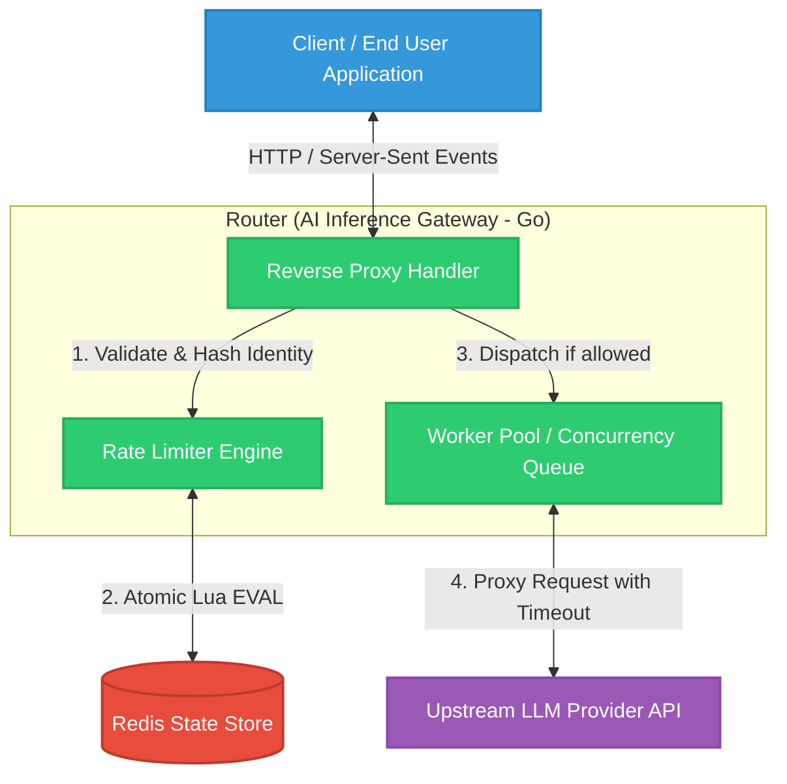
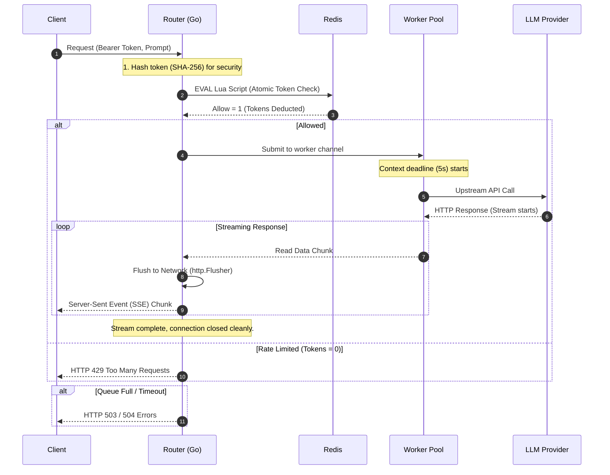

# Router: AI Inference Gateway (Day 1 - Day 9)
## A Senior Engineer's Technical Deep Dive

Welcome to the architectural overview of the **Router** project. This document serves as a comprehensive guide to understanding what we've built from Day 1 through Day 9. 

From a senior engineering perspective, building an API gateway for LLMs isn't just about forwarding HTTP requests. It is about **protecting the upstream** (LLM providers), **protecting the downstream** (the clients), and maintaining absolute stability under concurrent load. 

Here is the visual and technical breakdown of the system.

---

### 1. Overall Project Architecture (Visual Explanation)

The following diagram illustrates the high-level architecture of the Router gateway. It acts as the fortified middleman between our client applications and the upstream LLM providers (like OpenAI or Anthropic).

#### What you are looking at:
1. **Reverse Proxy Handler**: The entry point. It strips hop-by-hop headers, manages request contexts, and ensures the response body streams chunks dynamically instead of buffering them in memory.
2. **Rate Limiter**: Ensures a single noisy tenant doesn't consume all our API bandwidth. It uses a hashed version of the API key for security.
3. **Redis**: The external state layer. Since we might run multiple instances of our gateway, the rate-limiting token buckets must live here to enforce global limits.
4. **Worker Pool**: A bounded channel of Goroutines. It prevents unbounded concurrency from exhausting server resources when traffic spikes.

---

### 2. Request Movement & Data Flow (Visual Way)

How does data physically move from point A to point B? The sequence diagram below traces the exact lifecycle of a request flowing through the system.

#### Key Movements to Understand:
1. **Client to Proxy**: The user initiates a request. The proxy immediately hashes the credentials. We NEVER send or store raw tokens in our logs or databases.
2. **Proxy to Redis (The Lua Atomic Call)**: Instead of reading the token count and then updating it (which creates a race condition), we send a **single Lua script** to Redis. Redis executes it atomically.
3. **Worker to LLM**: We don't just spawn a Goroutine and hope for the best. The request is placed in a queue. If the queue is full, we return a `503 Service Unavailable`. If the LLM takes too long, our `context.WithTimeout` aborts it, returning a `504 Gateway Timeout`.
4. **LLM back to Client (Streaming)**: As the LLM generates words, they stream through the Worker to the Proxy. The Proxy uses Go's `http.Flusher` to push these chunks instantly to the client via SSE (Server-Sent Events), preventing the user from staring at a blank screen.

---

### 3. The Evolution: Day 1 to Day 9 (A Senior Perspective)

Understanding *why* we built it this way is just as important as knowing *what* we built. Over 9 days, this project evolved from a naive implementation into a robust, production-ready system. 

Here is the senior engineering breakdown of that journey:

#### The Foundation & Stability (Days 1 - 4)
* **Day 1 (The Custom Proxy)**: We avoided the out-of-the-box `httputil.ReverseProxy` because we needed granular control over connection headers and request cancellation contexts. A gateway must perfectly mimic a direct connection without leaking internal network details.
* **Day 2 (Worker Pools)**: In Go, spawning a Goroutine for every request is easy but dangerous. Under extreme load, unbounded Goroutines will OOM (Out of Memory) the server. By implementing a fixed worker pool, we placed a **hard ceiling on concurrency**.
* **Day 3 (Cooperative Cancellation)**: We tied `context.WithTimeout` to upstream calls. If an LLM provider hangs, our gateway cuts the connection at 5 seconds. We don't wait indefinitely.
* **Day 4 (Real Streaming)**: We realized `io.Copy` buffers data too much for LLM text generation. By implementing Go's `http.Flusher`, we forced the network socket to flush data chunks immediately, providing a true real-time SSE experience.

#### Scaling the State (Days 5 - 7)
* **Day 5 (The Token Bucket)**: We built an in-memory Rate Limiter using a token bucket algorithm. Tenants get a burst allowance that refills continuously.
* **Day 6 (Distributed State)**: In-memory state fails when you run multiple gateway servers (e.g., horizontally scaling). We moved the state to **Redis** so all gateway instances share the same truth. 
* **Day 7 (Security & Memory Leaks)**: Rereading our code, we found two massive flaws: 
  1. *Memory Leak*: Redis keys never expired. We added a TTL (Time-to-Live) tied to the bucket's refill rate.
  2. *Security Leak*: Raw API tokens were used as Redis keys. We implemented SHA-256 hashing to ensure tokens are securely anonymized in state and logs.

#### Exposing and Fixing Flaws (Days 8 & 9)
* **Day 8 (The Race Condition)**: Moving to Redis created a sub-millisecond gap. If 200 concurrent requests hit the gateway, they would all `GET` the token count from Redis *before* any of them could `SET` the new decremented count. Our stress test proved that 28 requests could slip through a 5-token limit!
* **Day 9 (The Lua Fix)**: We solved the race condition by rewriting the read-compute-write logic into a **Redis Lua Script**. Because Redis guarantees that no other command runs while a Lua script evaluates, the entire check-and-decrement process became indivisible (atomic). The leak was completely sealed.

### Conclusion
By Day 9, we have transitioned from a simple proxy to a highly concurrent, safe, distributed, and strictly enforced AI inference gateway. Every technical decision—from Lua scripts to worker pools—was driven by the realities of production engineering.
